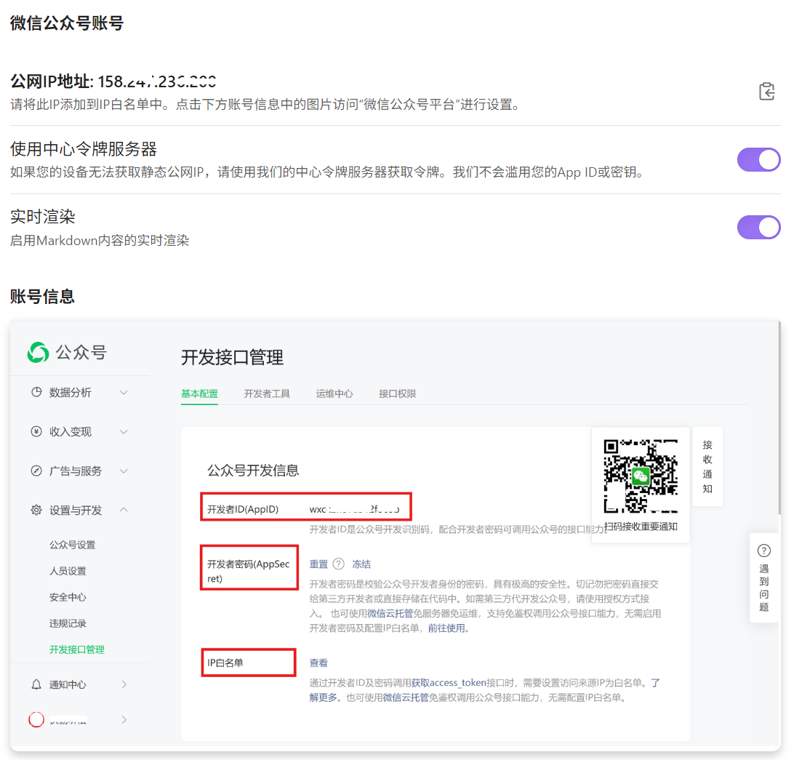
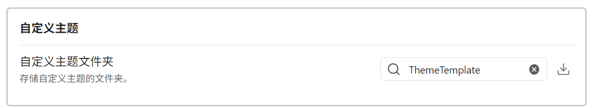
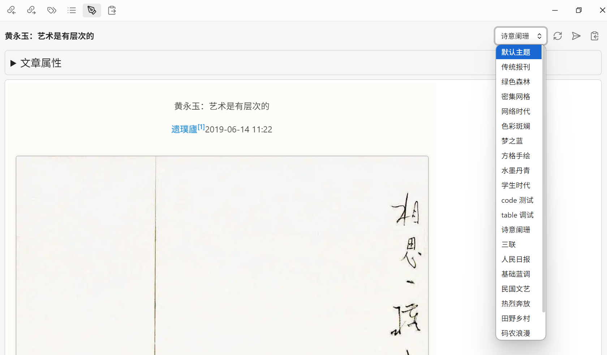
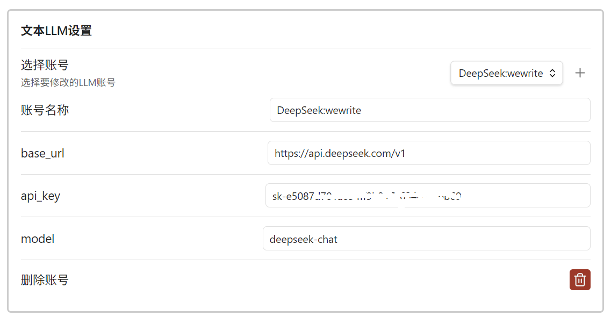
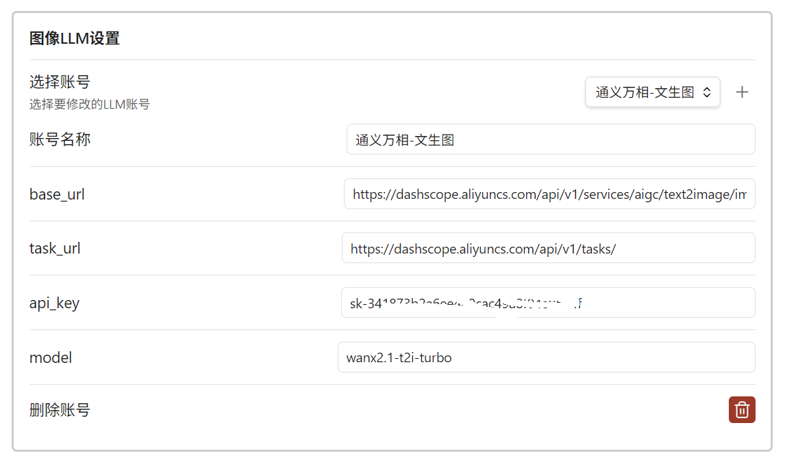

# WeWrite配置简介

## 公众号账号设置和公网IP地址 
向微信公众号平台发布文章时 ，需要使用公网IP地址，这个地址需要配置在微信公众号平台的白名单中。

如果网络环境比较复杂，无法获得公网IP地址，或公网IP总是变化，可以使用我们提供的中心令牌服务器。我们不会记录你的任何信息，也不会存储你的任何数据。

可能需要把我们服务器的地址添加到你的微信公众号的IP白名单中。
`123.112.138.166`

wewrite 需要微信公众号App的账号信息，包括：
- 公众号名称
- 公众号 AppID
- 公众号 AppSecret

这些信息可以在微信公众号平后台获取。
wewrite 支持多个公众号，渲染好的文章可以发布到多个公众号。

## 定制主题

wewrite 支持自定义主题来渲染微信文章，主题可以作为普通笔记（`.md` 文件）进行管理。
设定一个主题模板的目录，wewrite 会自动读取该目录下的所有主题模板。也可以从 GitHub 上下载我们提供的主题模板。

以这些模板作为起点，可以修改出自己的模板。

 

## AI 辅助功能

AI功能使用通用的大模型API，如DeepSeek, Kimi, 通义千问等等。使用OpenAI 兼容模式API。这些API的Key需要用户自己申请。

例如：
- [DeepSeek](https://api-docs.deepseek.com/zh-cn/)
- [Kimi](https://platform.moonshot.cn/docs/api/chat)

- [通义万相-文生图V2版](https://bailian.console.aliyun.com/?tab=api#/api/?type=model&url=https%3A%2F%2Fhelp.aliyun.com%2Fdocument_detail%2F2862677.html&renderType=iframe)

###  文本LLM

文本LLM，支持文本润色、翻译、同义词建议，生成文章摘要，mermaid流程图，latex公式。

###  图片LLM

图片LLM，支持图片生成，如微信公众号的封面图片，或者在文章中根据描述插入图片。

